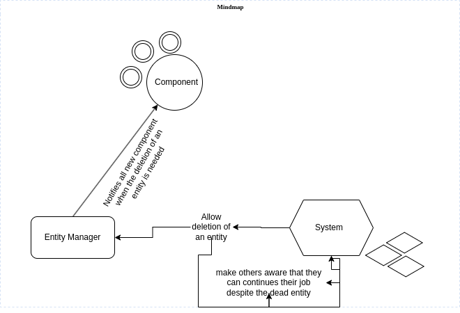

Main systems overviews
======================

This encompasses how the description of our system materializes the code
Architecture Design pattern
+++++++++++++++++++++++++++
According to the architecture, We are suppost to respect the ECS design pattern.
To remind, this stand for entity component system
Advantage of using the ECS
==========================
Choosing this design patterns helps escape a lot of problems in developing our engine.
First thing is the flexibility. To solve this ECS get started with a
blank object that has only the default required to do its job.
Due to inheritance trees might get messed up. In a gameplay inheritance can cause problems.
Second thing is the misuse of the cache because in a game we interate over a set of object a number of time(in fact multiple times per second)
And this causes a huge waste of the cache. It's the result we get by restarting our systems or looking 
for alternative to cool the CPU.
To solve this our ECS would keep all the data that will be iterated upon a 
tightly packed by using the only space required for it in our cache.
To summarize it we set to design our game with these goals
#. Making our code simple and understandable for every developers
#. Avoid a lot of if conditions to help avoid misprediction
#. Have a minimal use of inheritance

Another thing that we can do easily with the ECS is

.. :height: 500

Entity
======
An entity is simply an ID, that doesn't contain anything.
Instead the ID is used aspectsindex into an array of components.

    .. code-block:: cpp

        namespace Engine {
        class Entity {
        public:
            template<typename T>
            void addComponent(T component) {
                components[std::type_index(typeid(T))] = std::make_shared<T>(component);
            }
            template<typename T>
            T* getComponent() {
                auto it = components.find(std::type_index(typeid(T)));
                if (it != components.end()) {
                    return static_cast<T*>(it->second.get());
                }
                return nullptr;
            }
        private:
            std::unordered_map<std::type_index, std::shared_ptr<void>> components;
        };
        }

Component
=========
A component is a struct of data. It is as simple as an entity.

Example

    .. code-block:: cpp

        struct Position{
                int x;
                int y;
        }

Regarding our components, we came up with this.

    .. code-block:: cpp

        namespace Engine{
            class Component{
                public:
                virtual ~Component() = default;
                virtual std::vector<std::pair<std::string, std::string>> getRequireParams() = 0;
                virtual void setParam(std::string field, void *value) = 0;     // Assign a value to a component parameter
                virtual std::shared_ptr<void> getParam(std::string field) = 0; // Provides the value of a component parameter
                virtual std::string name() = 0;       // Get component name
                private:
                std::vector<std::pair<std::string, void*>> _data;                         
            };
   
        }

System
======
It embodies the whole logic of the game.
The behaviour behind each entity component.

    .. code-block:: cpp

        namespace Engine{
            class System{
                virtual ~System() = default;
                virtual void reset() = 0;   // Re-initialize the system in the event of a scene change if it's a system that uses duration (Gravity for example).
                // virtual void update(GameObject &target, double delta) = 0; // Enables the objects concerned to function. delta is the number of seconds elapsed since the scene was launched.
                virtual void update(Entity &entity, float deltaTime) = 0; // Allows the objects concerned to function. delta is the number of seconds that have elapsed since the scene was launched.
                virtual void handleInput(Entity &entity, std::vector<Entity> &projectiles, sf::Texture &bulletTexture);
            };
        }